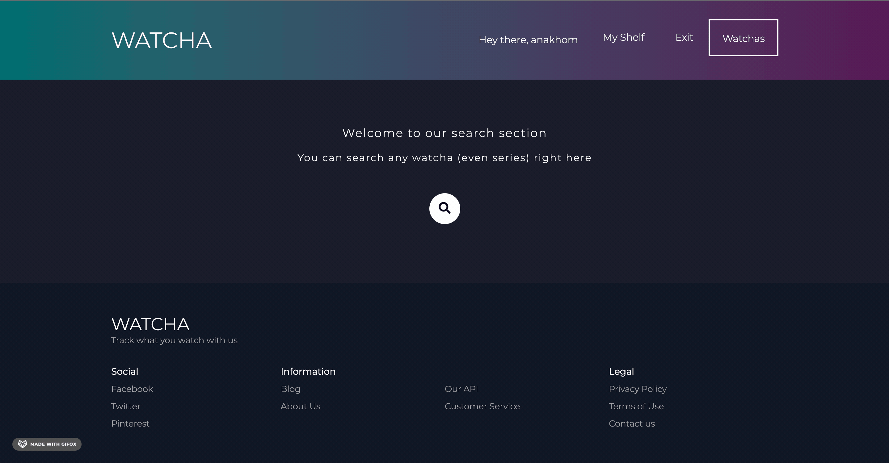

# WATCHA

Welcome to [WATCHA](https://watcha01.herokuapp.com), your personal tracker of movies and series you have watched or want to watch. 
At WATCHA we call movies and series 🎞 watchas 🎞, naturally. 
This app is for everyone who can't decide what to watch for way to long. Track all titles you love and never forget the name of that one movie you always wanted to see.

## Technologies:

<h2>***Please note that React version is already in the works!***</h2>

[][git]
[][git]
[][git]
[][git]
[][git]

 
 
 

- Frontend: Soon: React, Redux(Thunk), SCSS
- Backend: Node.js, Express, MongoDB, Mongoose, Bcrypt, Multer, NodeMailer
- API: Movie Database API, IMDb API

## Let's explore WATCHA

#### Although users can search watchas without being registered, they can only track them once they are logged in.

 

#### Welcome to user's shelf! All watched and wanted watchas are stored right here.

 

#### If no watcha comes to mind on a Friday night, we got you. Top 30 Watchas page shows world's current hottest and most popular watchas and the list constantly updates. You can add any watcha to watched or wanted right here.

 

#### There is a page for any watcha out there with more detailed info, of course.

 

#### Of course, there is a search engine featured that let's you find any watcha by name so you can add it to your list

 
 

 

### Future of WATCHA
WATCHA is just at the beginning of the journey. Initially written on handelbars, WATCHA's obvious future is React.js. But from there, we have some plans too:
 

- [X] Add option to follow friends and other users
- [X] Live feed displaying your friends' watchas 
- [X] Add chat options with WebSockets
- [X] More options for search engine, such as filters and recommendations 

#### Thank you for exploring WATCHA!

[git]: https://github.com/anakhom/watcha

