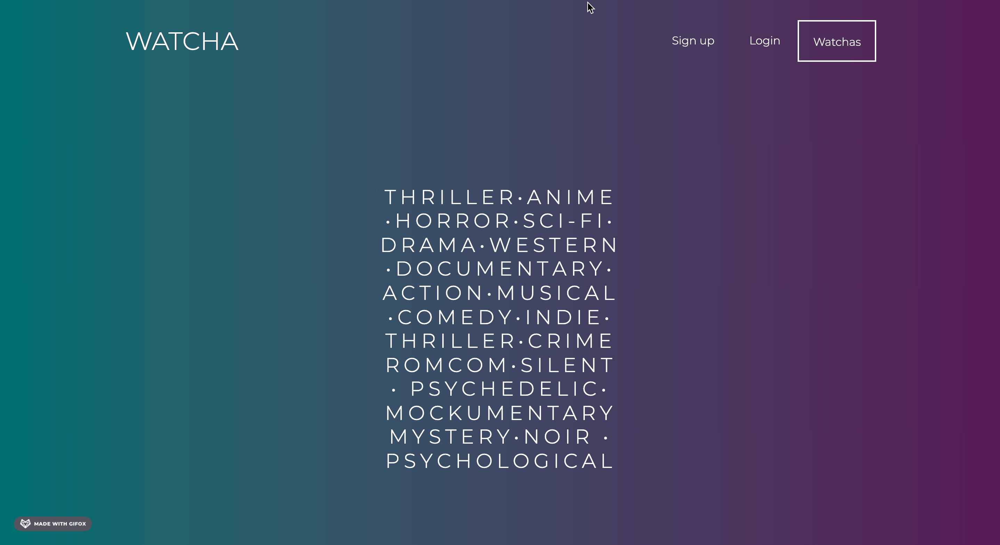

# WATCHA

Welcome to [WATCHA](https://watcha01.herokuapp.com), your personal tracker of movies and series you have watched or want to watch. 
At WATCHA we call movies and series 🎞 watchas 🎞, naturally. 
This app is for everyone who can't decide what to watch for way to long. Track all titles you love and never forget the name of that one movie you always wanted to see.

## Technologies:

<h2>***Please note that React version is already in the works!***</h2>

[][git]
[][git]
[][git]
[][git]
[][git]

 
 
 

- Frontend: Soon: React, Redux(Thunk), SCSS
- Backend: Node.js, Express, MongoDB, Mongoose, Bcrypt, Multer, NodeMailer
- API: Movie Database API, IMDb API

## Let's explore WATCHA

#### Although users can search watchas without being registered, they can only track them once thye are logged in.

#### Welcome to user's shelf! All watched and wanted watchas are stored right here.

#### If no wathca comes to mind on a friday night, we got you. Top 30 Watchas page shows world's current hottest and most popular watchas and the list constantly updates. You can add any watcha to watched or wanted right here.

#### There is a page for any watcha out there with more detailed info, of course.

#### Of course, all boxes can be shown right on the map as well. 

## Let's Talk Orders

#### Once user is logged in, they can reserve a box and receive a success modal and an email with the detailes of the order.

#### User can navigate to their DeliFood minimal profile where they can filter all, active or non-active orders, as well as change their user info.

#### Orders contain all the neccessary info, such as the restaurant's location and contact number, unique code, status, and the option to cancel the order.

#### Now it is time to go and pick up the deliciousness!

## Let's Talk Restaurants' CRM

#### Welcome to restaurant's minimal (we like minimal design here) profile, which can be, of course, updated.

#### Restaurant can view active, picked up, or expired boxes. It can see how many boxes were reserved and delete any box at any time (however, reserved boxes cannot be deleted!)

#### Restaurant can (and should 😉) create a new box if they feel like they have some delicious food left at the end of the day.

#### Restaurant can also view any active, picked up or expired orders once a hungry user reserves a box. An email is also sent to the restaurant notifying of a new order, which contains all the usefull info. 

#### Once the customer paid and took a mystery box home, the order can be market as picked up and the rest is history.

### Future of DeliFood
We want keep expanding our project and leave a bigger impact in the fight against food waste and here are our plans:
 

- [X] Add integrated check out
- [X] Add more businesses to our platform, such as grocery stores 
- [X] Add more customer support with WebSockets

#### Thank you for exploring DeliFood!

[git]: https://github.com/anakhom/DeliFood

